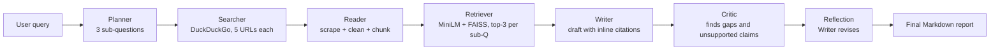

# Athena: Autonomous Multi-Agent Research Engine

**Live demo:** _[add your Hugging Face Space URL here]_

Ask one complex question. Athena breaks it into research angles, searches the live web, reads
and ranks the evidence, writes a cited report — then reviews its own draft and rewrites it.

## Architecture



Every stage writes back into one shared `ResearchState` object (see [models.py](models.py)),
so agents communicate through structured state rather than string passing.

| Stage | File | What it does |
| --- | --- | --- |
| Planner | `planner.py` | Splits the query into 3 search-optimized sub-questions (JSON mode) |
| Searcher | `searcher.py` | DuckDuckGo, one result per domain, blocked-host filter, offline fallback |
| Reader | `reader.py` | Fetches with a browser UA, trafilatura → BeautifulSoup, paragraph-aware chunking |
| Retriever | `retriever.py` | `all-MiniLM-L6-v2` embeddings + FAISS inner-product search, top 3 chunks |
| Writer | `writer.py` | Report with globally numbered `[Source X]` citations + reference list |
| Critic | `critic.py` | Reviews for unsupported claims, missing angles, vague statements |
| Reflection | `main.py` | Feeds the critique back to the Writer, streams the revised report |

## Why this matters

- **Multi-agent orchestration** — six specialized agents over one shared state object, not one
  mega-prompt.
- **Self-reflection loop** — the Critic catches uncited claims and missing angles, and the
  Writer revises automatically. This is the difference between a summarizer and a researcher.
- **Grounded by construction** — the Writer only ever sees retrieved chunks, each tagged with
  its source URL, and citations are numbered globally so `[Source 3]` means the same page
  everywhere in the report.
- **Zero external cost** — Groq's free tier, DuckDuckGo, and local `all-MiniLM-L6-v2`
  embeddings. No OpenAI key, no vector-DB bill.
- **Degrades instead of crashing** — dead links, 403s, JSON that isn't quite JSON, and
  DuckDuckGo rate limits are all handled without killing the run.

## Context budget

The naive version of this app feeds every scraped chunk to the Writer and blows the context
window. Athena keeps the top 3 chunks (~500 chars each) per sub-question — roughly 1.5k tokens
of evidence total — which is why the Writer stays fast and the citations stay accurate.

## How to run locally

```bash
pip install -r requirements.txt
cp secrets.env.example secrets.env   # then paste your free key from console.groq.com
python app.py                        # UI at http://127.0.0.1:7860
```

> **Windows note:** `faiss-cpu` and `torch` each bundle their own OpenBLAS, and their thread
> pools collide — encoding dies with a spurious "not enough memory" error. `retriever.py` caps
> the BLAS thread count on `win32` before torch loads; set `OMP_NUM_THREADS` yourself to override.

Or headless, straight to a Markdown file in `reports/`:

```bash
python main.py "What are the latest breakthroughs in Mixture of Experts?"
```

Individual agents are runnable on their own for debugging:

```bash
python planner.py     # prints the plan for three sample queries
python searcher.py    # prints the URLs a search returns
python smoke_test.py  # full pipeline with the LLM stubbed - no API key needed
```

## Deploying to Hugging Face Spaces

1. Create a Space with SDK **Gradio**, then push this folder to it.
2. Settings → *Variables and secrets* → add `GROQ_API_KEY` as a **secret**.
3. First build takes ~5 minutes while `sentence-transformers` downloads its weights; the model
   is cached for every run after that.

## Configuration

| Env var | Default | Purpose |
| --- | --- | --- |
| `GROQ_API_KEY` | — | Required. Free at [console.groq.com](https://console.groq.com) |
| `GROQ_MODEL` | `llama-3.3-70b-versatile` | Swap in any Groq-hosted model |

Tune `MAX_RESULTS_PER_QUERY` and `CHUNKS_PER_SUB_QUERY` in [main.py](main.py) to trade
breadth against latency.

## 🤔 What I'd do with 8 more hours

- **Parallelize the Searcher/Reader agents with `asyncio`** — fetching is the whole latency
  budget and it is entirely I/O-bound; this alone should cut runtime by ~60%.
- **Add a "Source Verifier" agent** that cross-checks each claim against a second URL and
  flags any fact only one source supports.
- **Persist research in a vector DB** so Athena remembers past reports and can answer
  follow-ups without re-searching.

## License

MIT
